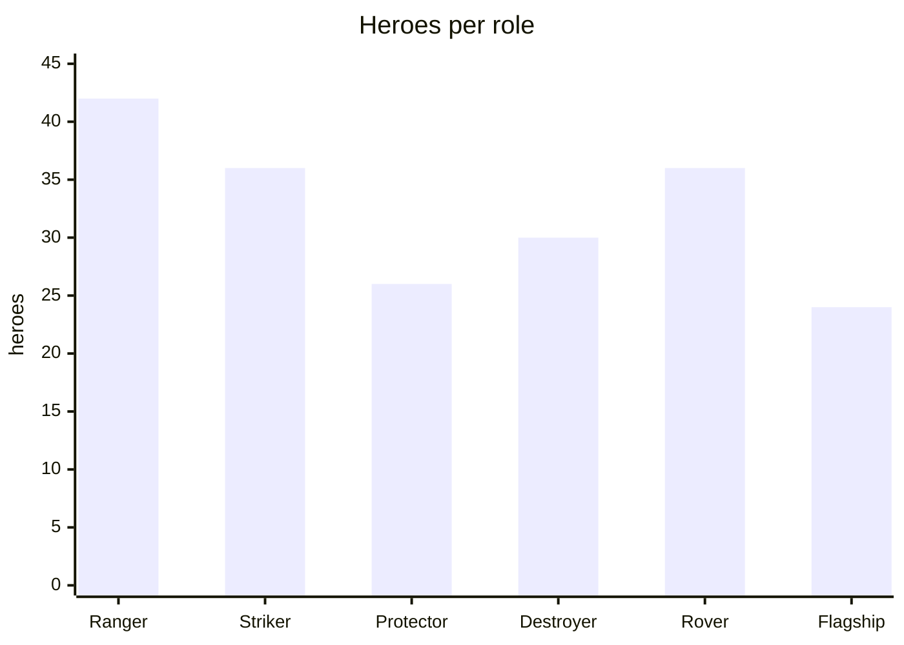

# Galaxy Legends — SSS Hero Database

Structured data for every SSS-rank commander in the mobile game **Galaxy Legends** (Tap4Fun),
extracted from the game's own files and shaped for AI and LLM use. Hand an agent *"which
Protector should I build?"* or *"compare these two at +T2"* and it has everything the in-game
Hero Handbook shows.

> Game data is **not** included. This repo ships the extraction pipeline and its output; you
> supply your own copy of the game files to rebuild. See [`NOTICE`](NOTICE) for rights and
> scope.

## At a glance

<p align="center">
  
</p>

| | |
|---|---|
| **Heroes** | 194 SSS, ids 327–646 |
| **Roles** | Ranger 42 · Striker 36 · Protector 26 · Destroyer 30 · Rover 36 · Flagship 24 |
| **Generations** | 96 latest · 98 old |
| **Skill entries** | 1,716 — 1,412 latest-gen tiers + 304 old-gen versions |
| **Augment costs** | 4,070 steps, 9,882 line items, **100% with a resolved item name** |
| **Localisation** | EN + CN names; 1,665 of 1,716 skill entries carry an English description |
| **Game version** | 2.6.2 |



## What's in the database

Each of the 194 heroes carries:

- **English and Chinese names** — 193 of 194 have an official English name
- **Role** and attack type, plus the game's own Damage / Defence / Assist ratings (1–10)
- **The full skill progression across augment states** — +0 … +15, +T, +T1 … +T4, Awaken,
  Second Awaken — with per-tier names and English descriptions
- **Augment material costs** for every step, with item names resolved
- Asset references (ship / avatar / pic image ids)

Two generations are modelled, matching how the game actually presents them:

| | Latest | Old |
|---|---|---|
| Heroes | 96 (ids 533–646) | 98 (ids 327–637) |
| Shape | up to 4 skill panels, each unlocking at its own augment state and upgrading Ⅰ → Ⅱ → Ⅲ → Ⅳ | one signature skill with richer Awaken and Second Awaken versions |
| Progression source | `heros_skill_skill` panels | `heros_ability` `SPELL_ID` per level, plus id offsets |

Generation is decided by whether a hero has skill-panel data at all — **not** by id. Fifteen
old-generation heroes carry ids above 532 (537, 548, 556, 559, 564, 568, 582, 588, 591, 596,
604, 620, 624, 630, 637), so "old = 327–532" is wrong.

Every hero's skills climb the same augment ladder — `+0 … +15 · +T · +T1 … +T4 · Awaken ·
Second Awaken` — but each hero unlocks at its own rungs. See
[`docs/DATABASE_SCHEMA.md`](docs/DATABASE_SCHEMA.md) for the ladder and how `from_augment` is
resolved.

## Files

| Path | Contents |
|---|---|
| `extracted/sss_database.json` | All 194 heroes — the primary deliverable |
| `extracted/by_class/*.json` | The same data split by role |
| `extracted/llm/*.md` | One Markdown file per role, formatted for LLM ingestion |
| `extracted/llm/GAME_KNOWLEDGE.md` | **Read this first.** What Galaxy Legends *is* — systems, combat model, augment ladder, economy, events, meta, naming traps |
| `extracted/loc/` | Localisation sources the build consumed |
| `extracted/raw_tables/` | Parsed game tables, one per source |
| `docs/heroes.html` | Browsable game-style handbook — same data, human-readable |

## Example entry

Ironwall Prototype: Serratine (Protector):

```json
{
  "id": 608,
  "name_en": "Ironwall Prototype: Serratine",
  "name_cn": "铁壁原型机：塞拉汀",
  "role": "Protector",
  "attack_type": "physical",
  "generation": "latest",
  "ratings": { "damage": 6, "defence": 10, "assist": 10 },
  "skills": [
    { "slot": 1, "name_en": "Astral Bastion", "unlocks_at": "+0",
      "tiers": [
        { "id": 1902,   "tier": 1, "tier_label": "Ⅰ", "from_augment": "+0",
          "name_en": "Astral BastionⅠ",  "description_en": "Vertical Attack, plunders 75% of the target's S-DEF, then …" },
        { "id": 111902, "tier": 2, "tier_label": "Ⅱ", "from_augment": "+6",  "name_en": "Astral BastionⅡ", "description_en": "…" },
        { "id": 121902, "tier": 3, "tier_label": "Ⅲ", "from_augment": "+10", "name_en": "Astral BastionⅢ", "description_en": "…" },
        { "id": 131902, "tier": 4, "tier_label": "Ⅳ", "from_augment": "+15", "name_en": "Astral BastionIV", "description_en": "…" }
      ] },
    { "slot": 2, "name_en": "Astral Reforge",    "unlocks_at": "+0", "tiers": [ "…", "up to Awaken" ] },
    { "slot": 3, "name_en": "Core Transference", "unlocks_at": "+2", "tiers": [ "…" ] },
    { "slot": 4, "name_en": "Ironwall",          "unlocks_at": "+4", "tiers": [ "…" ] }
  ],
  "augment": [
    { "to": "+1", "money": 100000, "items": [ { "id": 1203, "name": "Protector Chip", "qty": 5 } ] },
    { "to": "+6", "items": [ { "id": 1203, "name": "Protector Chip", "qty": 42 },
                             { "id": 1217, "name": "Pandora Power Core", "qty": 10 } ] },
    "… through Second Awaken"
  ]
}
```

## Rebuilding from game files

Place your own copy of the game data under `data/` — the APK's `tap4fun.zip` and the device's
`Documents/` folder — then run:

```bash
python3 scripts/extract_sss.py                                          # 1
python3 scripts/decrypt_tfl.py --all                                     # 2
python3 scripts/extract_tfl_data.py --loc EXTRA_TEXT.tfl.luac \
                                        EXTRA_TEXT_V1.tfl.luac           # 3a
python3 scripts/extract_tfl_data.py --rows v1_ExtraFleetInfo.tfl.luac    # 3b
python3 scripts/extract_loc_tables.py                                    # 4
python3 scripts/build_sss_db.py                                          # 5
python3 scripts/render_handbook.py                                       # 6
python3 scripts/export_llm.py                                            # 7
```

No third-party dependencies — standard library only.

## Documentation

| | |
|---|---|
| [`docs/PIPELINE.md`](docs/PIPELINE.md) | The seven stages, how they fit together, how the formats were cracked, and the regression guards |
| [`docs/DATA_FORMATS.md`](docs/DATA_FORMATS.md) | Byte-level layouts for `data1.pak`, `.tfl`, and the loc tables |
| [`docs/DATABASE_SCHEMA.md`](docs/DATABASE_SCHEMA.md) | Field-by-field reference for `sss_database.json` |
| [`AGENTS.md`](AGENTS.md) | Traps to avoid when changing the pipeline |
| [`docs/heroes.html`](docs/heroes.html) | The data, rendered for humans |

## Notes and known gaps

- Data comes from game version **2.6.2**.
- No numeric HP/ATK/DEF tables exist in the game data — combat stats are computed at runtime
  from the rating fields, which are included.
- Hero 643 (柯罗诺斯SP) has no English name, and SP skills 2032–2047 have no English name or
  description: none was ever shipped in any localisation file we could find.
- 51 of 1,716 skill entries lack an English description and 43 lack an English name, for the
  same reason.
- 17 old-generation heroes have only one skill version — no awaken id exists at any probed
  offset. These are the remaining candidates for a hidden gap in the model.

## Licence

The code and documentation are MIT licensed — see [`LICENSE`](LICENSE). The game data is not:
Galaxy Legends is copyrighted by Tap4Fun, and [`NOTICE`](NOTICE) sets out what this project
does and does not distribute.
