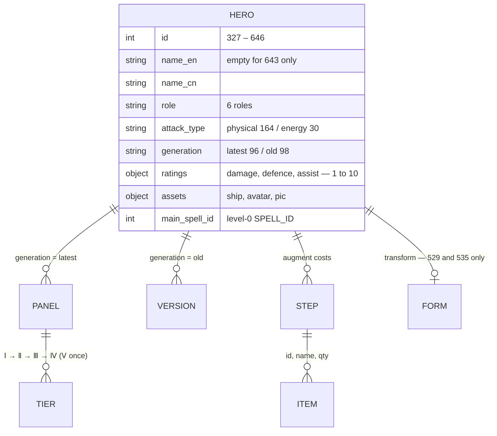
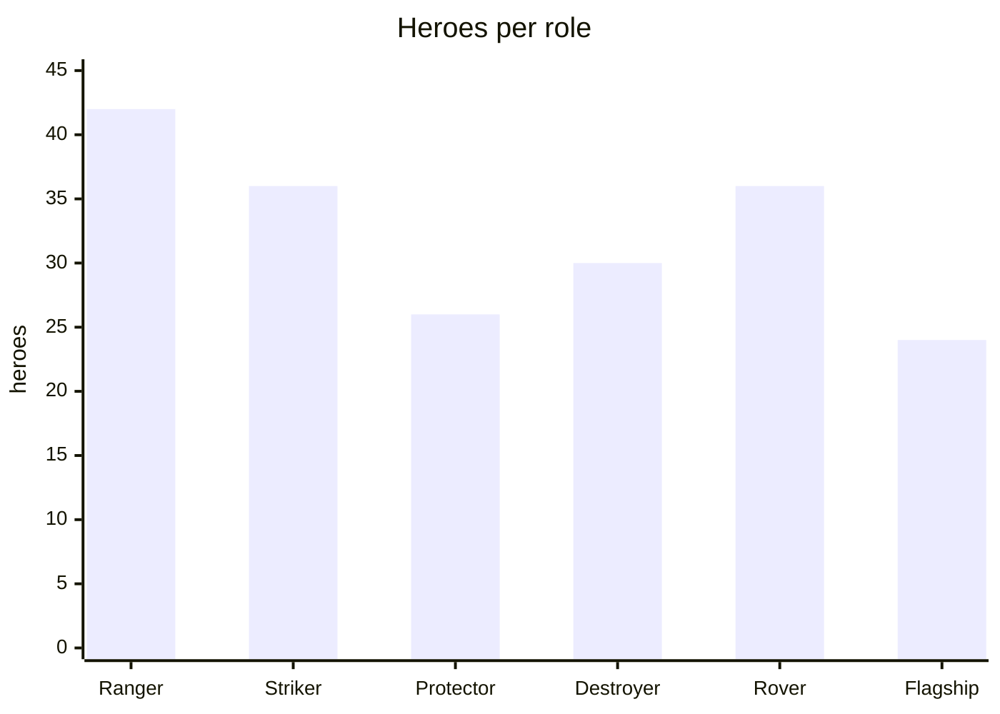
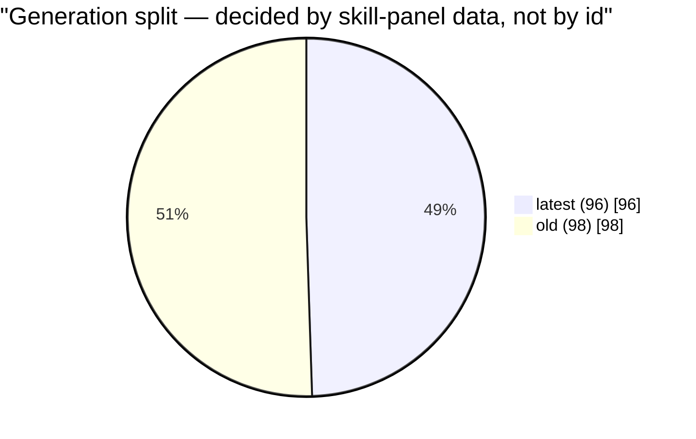
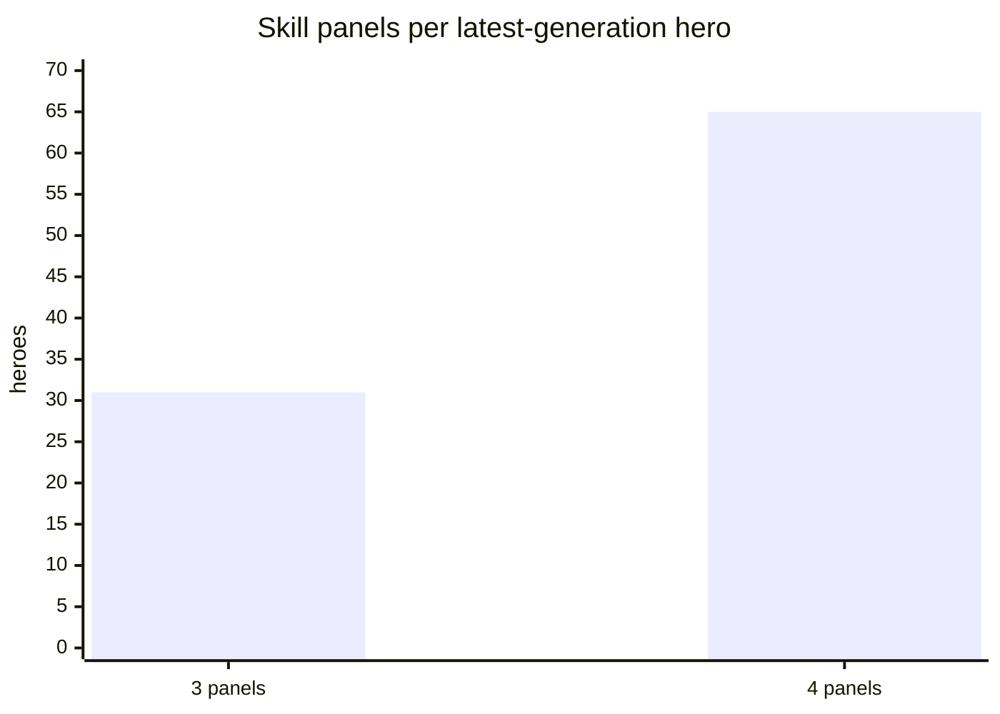
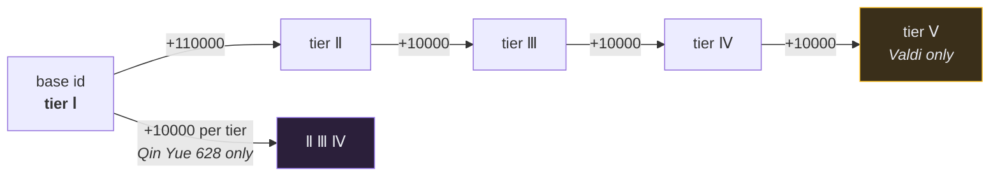
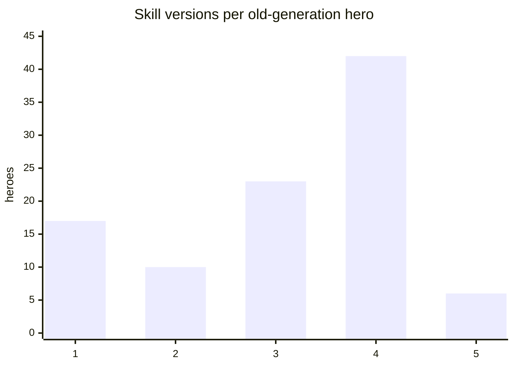
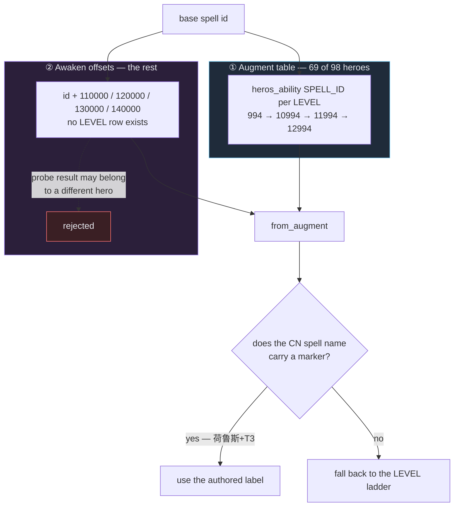
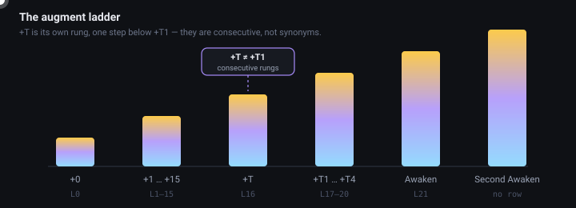

# Database Schema

Field-by-field reference for `extracted/sss_database.json`. The six files in
`extracted/by_class/` use the identical schema — they are exact subsets, one per role.

Top level is a JSON array of **194 hero objects, sorted by id**.

## Object model



## Hero object

| Field | Type | Description |
|---|---|---|
| `id` | int | Game hero id (matches `NPC_<id>` loc keys) |
| `name_en` | string | Official English name — empty only for hero 643 |
| `name_cn` | string | Current Chinese display name |
| `role` | string | `Ranger` 42 · `Striker` 36 · `Protector` 26 · `Destroyer` 30 · `Rover` 36 · `Flagship` 24 |
| `attack_type` | string | `physical` (164) or `energy` (30) |
| `generation` | string | `latest` (96) or `old` (98) |
| `ratings` | object | `damage` / `defence` / `assist`, each 1–10 |
| `assets` | object | `ship`, `avatar`, `pic` image references |
| `main_spell_id` | int | Primary skill id (level-0 `SPELL_ID`) |
| `skills` | array | Generation-specific — shape differs, see below |
| `augment` | array | Per-step upgrade cost |
| `transform` | object | Only on 529 and 535 — the transformed form's id, name and skills |





### ratings

```json
{ "damage": 6, "defence": 10, "assist": 10 }
```

The game's own 1–10 bars. **The `assess` field (1–30) is deliberately not stored** — it is
`30` for every SSS hero at every hero level, checked across all 9,960 `heros_ability` rows, so
it carries zero information. `rate` is the only value that varies.

Numeric HP/ATK/DEF do not exist in the shipped data; the game derives them at runtime from
these ratings. Their distributions across the 194 heroes:

```
Damage   (peaks at 9–10)          Defence  (peaks at 6–7)         Assist   (broad)
 1     0  ·                        1     0  ·                      1     1  ▏
 2     0  ·                        2     0  ·                      2     1  ▏
 3     1  ▏                        3     0  ·                      3     1  ▏
 4    10  ████                     4     0  ·                      4     2  █
 5     8  ███                      5     6  ██                     5     8  ███
 6    22  ████████                 6    36  ████████████           6    29  █████████████
 7    19  ███████                  7    68  ██████████████████████ 7    32  ███████████████
 8    20  ███████                  8    49  ████████████████       8    47  ██████████████████████
 9    52  ██████████████████       9    11  ████                   9    27  ████████████
10    62  ██████████████████████  10    24  ████████              10    46  █████████████████████
```

**Attack type is fully determined by role.** All 30 Destroyers are `energy`; every hero of
every other role is `physical` (164 total). There are no mixed roles.

---

## skills — latest generation (array of panels)

The game gives every hero four fixed slots; each slot is one skill panel with its own tier
chain. 65 heroes ship all 4 panels, 31 ship 3.



```json
{
  "slot": 1,
  "name_en": "Astral Bastion",
  "unlocks_at": "+0",
  "tiers": [
    { "id": 1902,   "tier": 1, "tier_label": "Ⅰ", "from_augment": "+0",
      "name_en": "Astral BastionⅠ",
      "description_en": "Vertical Attack, plunders 75% of the target's S-DEF, then …" },
    { "id": 111902, "tier": 2, "tier_label": "Ⅱ", "from_augment": "+6",  "name_en": "Astral BastionⅡ", "description_en": "…" },
    { "id": 121902, "tier": 3, "tier_label": "Ⅲ", "from_augment": "+10", "name_en": "Astral BastionⅢ", "description_en": "…" },
    { "id": 131902, "tier": 4, "tier_label": "Ⅳ", "from_augment": "+15", "name_en": "Astral BastionIV", "description_en": "…" }
  ]
}
```

- `slot` — the panel's position in the game UI (1–4)
- `name_en` — the panel name with the tier numeral stripped (`Astral BastionⅠ` → `Astral Bastion`)
- `unlocks_at` — first augment state at which the panel exists
- `tiers[].from_augment` — augment state at which that tier becomes active
- `tiers[].tier_label` — roman numeral as the game displays it

**Tier id encoding.** Two schemes appear in the data:



Tier numbers are read from the id encoding where it decodes, otherwise from slot position.

**Gaps are real, not parse errors.** Valdi (550) ships tiers Ⅰ, Ⅱ, Ⅳ, Ⅴ — tier Ⅲ (id
`121642`) does not exist in any shipped file.

**Unreleased slots.** Id `30000` means "no skill here yet". It appears only in slot 4, on 30
heroes spanning **all six roles** — it is *not* flagship-specific, as only 3 of the 24
flagships have it. These slots are dropped from the output, which is why 31 latest-gen heroes
have 3 panels: 30 placeholders plus Colin (549), who genuinely has three.

**Awaken sets (`flagship_awaken_skill`).** 13 heroes carry a second skill table the slot rows
never reach: their `LEVEL 21` row holds per-slot ids for Awaken and Second Awaken, one or two
tiers beyond what `skill_one..four` ever contain. Saint Kilian (538) is the canonical case —
his slot 2 stops at `111561` (Ⅱ) in the slot table, but the awaken field adds `121561` at
Awaken and `131561` at Second Awaken. These are appended to the matching panel as further
tiers. **The field is populated only on the LEVEL 21 row** — reading LEVEL 0 silently
returns `[]`.

Format: `{{{1,131560},{2,121561},{3,131562}},{{1,131560},{2,131561},{3,131562}}}` — one group
per awaken state, each a list of `{slot, skill_id}`.

## skills — old generation (array of versions)

One signature skill, listed as the versions it takes as you augment. Ordered. 304 versions
across the 98 old-gen heroes.



```json
[
  { "id": 994,   "tier_label": "Ⅰ", "from_augment": "+0",  "name_en": "Dead Silence Ⅰ", "name_cn": "死亡沉寂 Ⅰ",          "description_en": "…" },
  { "id": 10994, "tier_label": "Ⅱ", "from_augment": "+T",  "name_en": "Dead Silence Ⅱ", "name_cn": "荷鲁斯+T，死亡沉寂Ⅱ",   "description_en": "…" },
  { "id": 11994, "tier_label": "Ⅲ", "from_augment": "+T3", "name_en": "Dead Silence Ⅲ", "name_cn": "荷鲁斯+T3，死亡沉寂Ⅲ",  "description_en": "…" },
  { "id": 12994, "tier_label": "Ⅳ", "from_augment": "+T4", "name_en": "Dead Silence Ⅳ", "name_cn": "荷鲁斯+T4，死亡沉寂IV", "description_en": "…" }
]
```

**Two distinct progression mechanisms exist, and both are merged into this array:**



1. **Augment-table progression** (69 of 98). `heros_ability` stores a `SPELL_ID` per augment
   `LEVEL`; reading only `LEVEL == 0` — as the first version of this pipeline did — throws the
   whole chain away. Horus (460) is the canonical case: `994` at +0 → `10994` at +T → `11994`
   at +T3 → `12994` at +T4.

   **The augment label is authored per version, not derived from `LEVEL`.** The game writes it
   into the Chinese spell name (`荷鲁斯+T3，死亡沉寂Ⅲ`) and that string is what the client
   shows, so `from_augment` prefers that marker and only falls back to the level ladder when
   the name carries none. Deriving it from `LEVEL` alone puts a phantom `Awaken` tier on
   heroes whose last skill update is at `+T4`.
2. **Awaken-offset progression** (the rest). Further tiers exist only as id offsets with no
   level row: `+110000` = Ⅱ, `+120000` = Ⅲ, `+130000` = Ⅳ, `+140000` = Ⅴ. Janus (529) is the
   canonical case. With no level known, the authored marker in the Chinese name is used first
   (`觉醒+2` → `Second Awaken`), then `Awaken` / `Second Awaken`. Past that the game has no
   known display name, so output stays descriptive — `Awaken +3` / `Awaken +4` — rather than
   inventing a "Third Awaken".

   **Offset probing can collide with another hero's spell id**, because `base + 110000` is just
   arithmetic. Welly (620) probing +110000…+140000 reaches ids that `heros_ability` assigns to
   Roche (621), not Welly — the names even say `洛希+6`. Those are rejected. Sharing is still
   allowed when the name names the hero: Wukong's clone (471) legitimately uses 470's ids.

Tier ids within mechanism 1 step by `+10000 / +11000 / +12000 / +13000` for tiers Ⅱ–Ⅴ.
`tier_label` is read from the skill's own name where the game writes the numeral into the
string (`Dead Silence Ⅱ`), and only falls back to a computed value.

---

## augment (array, ordered by augment state)

```json
[
  { "to": "+1", "money": 100000, "items": [ { "id": 1203, "name": "Protector Chip", "qty": 5 } ] },
  { "to": "+6", "items": [ { "id": 1203, "name": "Protector Chip", "qty": 42 },
                           { "id": 1217, "name": "Pandora Power Core", "qty": 10 } ] }
]
```

Parsed from the game's raw condition strings (`[{item,{1203,5}},{money,100000}]`). `money` is
omitted when a step costs none. 4,070 steps across 194 heroes (190 heroes list 21 steps, 4
list 20), containing **9,882 line items, 100% with a resolved name**, drawn from 173 distinct
materials. Item names resolve by combining two loc sources:

- `loc/extra_text_en.json` → `LC_ITEM_ITEM_NAME_<id>` for newer materials
- `loc/all_loc_en.json` → `item.ITEM_NAME_<id>` for older ones (chips 1201–1206, Pandora Power
  Core 1217, Pandora Power Crystal 20423)

Most-requested materials across every augment step in the database:

```
Pandora Power Core      1940  ██████████████████████
Pandora Power Crystal   1552  █████████████████
Inert Alloy              813  █████████
Heated Alloy             813  █████████
Ranger Chip              615  ███████
Striker Chip             570  ██████
Rover Chip               540  ██████
Destroyer Chip           450  █████
Protector Chip           390  ████
Alien Essence            347  ████
```

## Augment states

<p align="center">
  
</p>

The internal `LEVEL` integer runs 0–21: 0–15 = `+0`–`+15`, 16 = `+T`, 17–20 = `+T1`–`+T4`,
21 = `Awaken`. `heros_ability` tops out at `LEVEL 21`, and **no commander gets a new spell at
LEVEL 21**, so that row is effectively padding. Second Awaken has no level row at all and
surfaces only through `flagship_awaken_skill` and the id-offset probe.

## transform

Present on exactly two heroes: **529** (Janus) and **535** (Phoenix). Transform variants
530 and 536 are not separate heroes in this database — they are merged into their base hero
as `transform`, carrying the transformed form's id, name and skills.

## Known gaps

These are absences in the game's own shipped data, not extraction failures.

| What | Why |
|---|---|
| Hero 643 (柯罗诺斯SP) has no `name_en` | Never localized in any shipped file |
| Skills 2032–2047 (SP heroes 643/646) have no `name_en` / `description_en` | Never localized |
| Valdi's tier-Ⅴ skill has no name | Never localized |
| 51 of 1,716 skill entries have no `description_en`; 43 have no `name_en` | Not present in any loc file |
| 17 old-gen heroes have only one skill version | They reach Second Awaken, but no awaken skill id exists at any probed offset and they have no level progression — see below |

The 17 single-version heroes, ordered by id:

| | | | |
|---|---|---|---|
| 366 Elijah | 402 Natasha | 477 Erlang Shen | 517 Kristen |
| 524 Sasha | 537 Silvia | 548 Hassan | 556 Bebo |
| 559 Bonnie | 564 Kelly | 568 Yvonne | 588 Vera |
| 591 Amber | 620 Welly | 624 Vid | 630 Jiang Changxing |
| 637 Darius | | | |

If the game *does* show any of them an awaken skill, its id follows neither known encoding.
These are the remaining candidates for a hidden gap in the model.

## Reading it as text

`docs/heroes.html` renders this same data as a browsable handbook — role filters, full-text
search, skill panels and readable augment tables. Rebuild with `scripts/render_handbook.py`.
