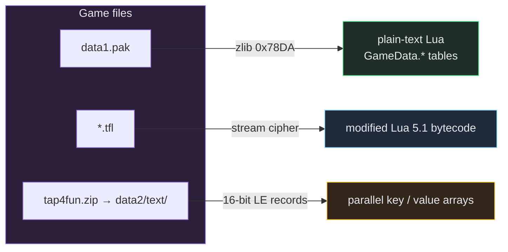
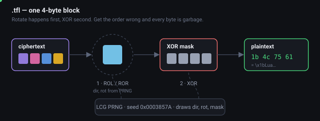
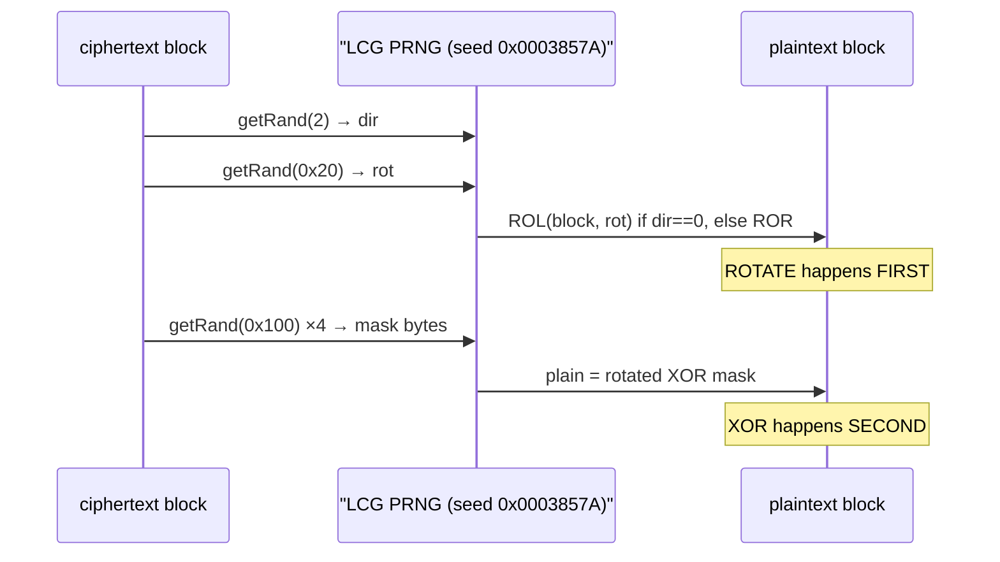

# Game Data Formats

Exact byte-level layouts for every Galaxy Legends file format this project parses. All
verified against the shipped files of game version **2.6.2**.



---

## data1.pak — Lua table archive

A flat container of zlib-compressed Lua scripts, with no directory structure.

Valid zlib streams begin with `0x78 0xDA` (other `0x78xx` bytes occur, but every script stream
in this pak is `0x78DA`). Each decompressed script is plain-text Lua that populates a
`GameData.<path>` table:

```lua
local Ability = GameData.heros.Ability
table.insert(Ability, {
    ["ID"] = 608,
    ["LEVEL"] = 0,
    ["condition"] = "[{item,{1203,5}},{money,100000}]",
    ...
})
```

Two rules that are easy to get wrong:

- **Identify a table by the `GameData.<path>` declaration at the head of the file.** Several
  scripts merely *reference* the same paths, so matching anywhere else picks the wrong one.
- **Parse entries with brace matching.** Values like `condition` contain nested `{}` inside
  strings, which breaks a naive regex.

```
data1.pak
┌─────────────────────────────────────────────────────────┐
│ 78 DA <…deflate…>  →  script 1   GameData.heros.Ability │
│ 78 DA <…deflate…>  →  script 2   GameData.heros.basic   │
│ 78 DA <…deflate…>  →  script 3   (references only)      │
│ …                                                        │
└─────────────────────────────────────────────────────────┘
```

---

## .tfl — encrypted Lua bytecode

A whole-file stream cipher. **There is no header** — the 16-byte prefix that looks like one is
simply the first ciphertext.

### Cipher

<p align="center">
  
</p>

From `libgalaxylegend.so` (arm64): an LCG PRNG drives a rotate-then-XOR over 4-byte blocks.



```
PRNG (getRand @ 0x0ad100):
    state = state * 0x19660d + 0x3c6ef35f   (mod 2^32)
    getRand(max) = (state >> 16) % max

Seed: 0x0003857A   (passed at the game's open-file call site @ 0x0b2aac)

Per 4-byte block:
    dir  = getRand(2)
    rot  = getRand(0x20)
    rotated = ROL(block, rot)  if dir==0  else  ROR(block, rot)   # rotate FIRST
    mask = getRand(0x100)<<24 | getRand(0x100)<<16
         | getRand(0x100)<<8  | getRand(0x100)
    plain = rotated ^ mask                                        # then XOR

Tail (1–3 bytes): same scheme, width-sized rotates (24 / 16 / 8 bits)
Blocks processed: ((size - 4) >> 2) + 1
```

Four wrong assumptions cost the most time here, in case you retrace this:

| Assumption | Reality |
|---|---|
| plaintext is zlib (`0x78 0x9C`) | it is Lua 5.1 bytecode (`\x1bLuaQ`) |
| XOR first, then rotate | **rotate first, then XOR** |
| the 16-byte prefix is a header | it is ciphertext — decrypt the whole file |
| stock Lua 5.1 opcodes | the VM shuffles opcodes and widens operands |

The original notes also carried a hex typo — `0x1b2aac` for `0x0b2aac` — which had sent earlier
readings to the wrong function entirely.

### Bytecode layout

Plaintext is a modified Lua 5.1 chunk:

```
 0  1  2  3  4  5  6  7  8  9 10 11
┌──┬──┬──┬──┬──┬──┬──┬──┬──┬──┬──┬──┐
│1b│4c│75│61│51│00│01│04│04│04│08│00│   12-byte header (top chunk ONLY)
└──┴──┴──┴──┴──┴──┴──┴──┴──┴──┴──┴──┘
 │  `\x1bLua'  │  │  │  │  │  │  └─ integral flag = 0
 │             │  │  │  │  │  └──── sizeof(lua_Number) = 8  ← 8-byte DOUBLE
 │             │  │  │  │  └─────── sizeof(Instruction) = 4
 │             │  │  │  └────────── sizeof(size_t) = 4
 │             │  │  └───────────── sizeof(int) = 4
 │             │  └──────────────── endianness = 1
 │             └─────────────────── version = 0
 └───────────────────────────────── magic `\x1bLuaQ'

then, per chunk — nested protos carry NO magic header, only the top chunk does:

 ┌─ source name          4-byte length + bytes
 ├─ linedefined          4 bytes
 ├─ lastlinedefined      4 bytes
 ├─ nups, nparams, vararg, maxstack   1 byte each
 ├─ ncode                4 bytes, then ncode × 4-byte instructions
 ├─ nconst               4 bytes, then constants:
 │      0 = nil   1/2 = bool   3 = double (8 bytes!)   4 = string
 │      string = 4-byte length + bytes, including the trailing \x00
 ├─ nproto               4 bytes, then nested protos (recursive)
 └─ debug info           lineinfo (4-byte count + entries), locals, upvalue names
```

Reading `lua_Number` as a 4-byte float desynchronises the whole constant table on large files.

### Modified opcode map

| op | Meaning |
|---|---|
| 3 | LOADK-extended: `R[A] := K[Bx]` with an 18-bit Bx |
| 7 | NEWTABLE — begins a row in data chunks |
| 10 | SETTABLE: `R[A][RK(B)] := RK(C)` — 9-bit operands, `RK(x) = K[x-256]` if `x ≥ 256` else `R[x]` |
| 11 | GETGLOBAL-ish: `R[A] := K[C]` |
| 12 | CALL (`table.insert`) |

Two data shapes occur:

1. **Localisation chunks** (`EXTRA_TEXT*.tfl`) — one giant table per language, delimited by
   closure (op 7) boundaries. Segment order is
   `[header, GER, FR, EN, ZH, CN, RU, TR, JP, IT, KR, NL, IDO]`, so **EN is segment index 3**
   and simplified CN is index 5.
2. **Register-machine row chunks** (`ExtraFleetInfo.tfl`) — rows delimited by op 7, fields
   accumulated via op 3 (load a const index into a register) and op 10 (set field). This is
   where the old-generation Spells table lives.

---

## Loc text tables (.idx / .en / .cn / … in tap4fun.zip)

Key list (`.idx`) and value lists (`.<lang>`) are parallel arrays:

```
┌────────┬─────────────────────────────────────────────┐
│ count  │ 2 bytes, little-endian                      │
├────────┼─────────────────────────────────────────────┤
│ rec 0  │ len (2 bytes LE) │ UTF-8 bytes …            │
│ rec 1  │ len (2 bytes LE) │ UTF-8 bytes …            │
│ …      │                                             │
└────────┴─────────────────────────────────────────────┘
```

**Record lengths are 16-bit.** An 8-bit parse silently misjoins every string longer than 127
bytes and desynchronises the entire table — this bug produced correctly-shaped but wrong skill
names for the whole first run. The same 16-bit format applies to the OBB's `battle.*`,
`newbattle.*` and `event.*` tables.

---

## Known file inventory

| File | What it is |
|---|---|
| `data1.pak` | Hero / spell / item / battle Lua tables (zlib streams) |
| `EXTRA_TEXT.tfl` (v2511), `EXTRA_TEXT_V1.tfl` (v2850) | ~48k localisation pairs per language (`LC_*` keys) |
| `v1/ExtraFleetInfo.tfl`, `v2/ExtraFleetInfo.tfl` | Older-generation hero / fleet / spell tables |
| `tap4fun.zip → data2/text/*` | Original per-domain loc tables (fleet, npc, item, menu, …) |
| `*.tfs` (CWS / ZWS / XWS) | UI layout XML (zlib / LZMA) — not game data |
| `fl_lzma_3to1.tfl`, `ofl*.tfl`, `lfl*.tfl`, `hrfl`, `levl`, `pcl`, `MAIL`, `AlertDataListExtra` | File-CRC manifests and version tables — not game data |

**No HP / ATK / DEF tables exist anywhere in the shipped data.** Combat numbers are computed at
runtime from the Damage / Defence / Assist ratings; the CRC-manifest TFLs look like they might
hold them and do not.
