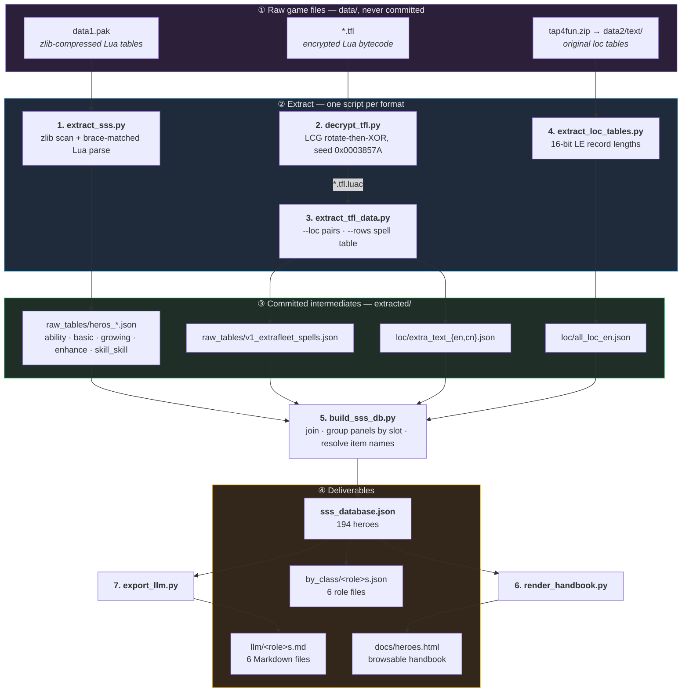
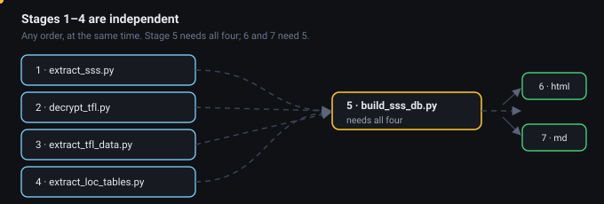
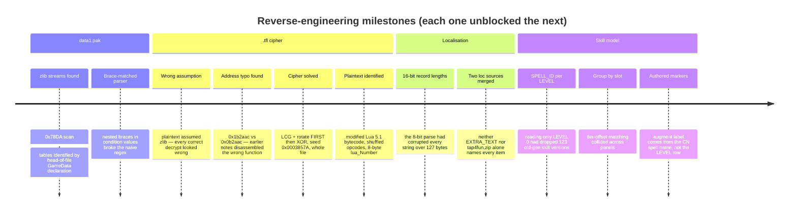
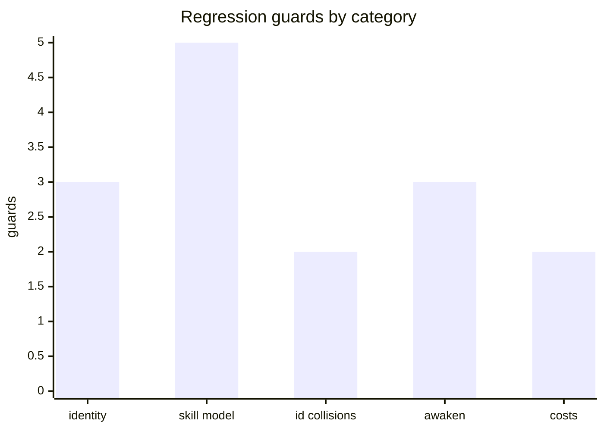

# Pipeline

Seven scripts turn the raw game files into every artefact in `extracted/`. Each stage's
output is committed, so the intermediate results are inspectable and you only need the raw
game data to rebuild everything from scratch.

## The flow



Run it end to end:

```bash
python3 scripts/extract_sss.py                                   # 1
python3 scripts/decrypt_tfl.py --all                              # 2
python3 scripts/extract_tfl_data.py --loc EXTRA_TEXT.tfl.luac \
                                        EXTRA_TEXT_V1.tfl.luac    # 3a
python3 scripts/extract_tfl_data.py --rows v1_ExtraFleetInfo.tfl.luac   # 3b
python3 scripts/extract_loc_tables.py                             # 4
python3 scripts/build_sss_db.py                                   # 5
python3 scripts/render_handbook.py                                # 6
python3 scripts/export_llm.py                                     # 7
```

| Stage | Script | Reads | Writes |
|---:|---|---|---|
| 1 | `extract_sss.py` | `data1.pak` | `raw_tables/heros_*.json` |
| 2 | `decrypt_tfl.py` | `data/**/*.tfl` | `*.tfl.luac` (gitignored) |
| 3 | `extract_tfl_data.py` | `*.tfl.luac` | `loc/extra_text_{en,cn}.json`, `raw_tables/v1_extrafleet_spells.json` |
| 4 | `extract_loc_tables.py` | `tap4fun.zip` | `loc/all_loc_en.json` |
| 5 | `build_sss_db.py` | all of the above | `sss_database.json`, `by_class/` |
| 6 | `render_handbook.py` | `sss_database.json` | `docs/heroes.html` |
| 7 | `export_llm.py` | `sss_database.json` | `llm/<role>s.md` |

Stages 1–4 are independent of each other and can run in any order; 5 needs all four; 6 and 7
need 5.

<p align="center">
  
</p>

---

## Stage 1 — extract_sss.py

Scans `data1.pak` for zlib streams (`0x78DA`), decompresses each one, and identifies a table
by the `GameData.<path>` declaration **at the head of the file** — several scripts merely
*reference* the same paths, so matching anywhere but the head picks the wrong one. Entries are
`table.insert(T, { … })` blocks parsed with brace matching, because values like `condition`
contain nested braces. Emits the five hero tables as JSON.

## Stage 2 — decrypt_tfl.py

Reverses the whole-file stream cipher documented in `DATA_FORMATS.md`: LCG-seeded
rotate-then-XOR, seed `0x0003857A`, applied to the entire file including the 16-byte prefix
that looks like a magic header but is just ciphertext. `--all` decrypts every TFL under
`data/`. Output is modified Lua 5.1 bytecode.

## Stage 3 — extract_tfl_data.py

Two modes against the decrypted bytecode:

- **`--loc`** — walks EXTRA_TEXT instruction streams (op3 loads, op10 `SETTABLE` pairs),
  splits key/value pairs into per-language segments at closure boundaries, and emits EN
  (segment 3) and CN (segment 5). Merges the v2511 and v2850 versions.
- **`--rows`** — interprets the register-machine stream in ExtraFleetInfo (op3/op7/op10/op11)
  and emits the old-generation Spells table, which is where old heroes' Awaken-tier skill
  names live.

## Stage 4 — extract_loc_tables.py

Reads the `.idx` (keys) and `.en` (values) tables from `tap4fun.zip`'s `data2/text/` using
16-bit record lengths, and emits one merged map. This is the source of the fleet skill names
and descriptions (`SKILL_NAME_*`, `SKILL_DES_*`) and the role labels (`TYPE_*`).

## Stage 5 — build_sss_db.py

The join. In order:

1. Hero identity and ratings from `heros_ability.json`, keeping rank 100/200 rows (= SSS)
2. Drop test heroes 998/999; merge transform variants 530→529 and 536→535 into `transform`
3. Names — EN from `extra_text_en` (`LC_NPC_NPC_<id>`), CN from `extra_text_cn`, which
   overrides stale names in `data1.pak`
4. Roles from the `vessels` field via `TYPE_*` labels
5. Skills — latest-gen heroes get one panel per **slot**, each with its own tier chain across
   augment states; old-gen heroes get their version chain from `heros_ability` plus
   `v1_extrafleet_spells.json`
6. Augment costs from `heros_enhance.json`, parsed out of raw condition strings into
   `{money, items[{id, name, qty}]}` with item names resolved from both loc sources
7. Write per-role subsets to `by_class/`

**Panels are grouped by slot, never by matching tier offsets.** The first version inferred
panels with `sid - 110000 in seen`, which mis-groups any hero whose tier ids collide with
another panel's — Qin Yue (628) steps by +10000, not +110000, and came out as six panels with
two tiers mis-numbered. Slots are what the game actually renders.

## Stage 6 — render_handbook.py

Reads `sss_database.json` and writes one self-contained `docs/heroes.html` — role filters,
full-text search, a card per hero with ratings, skill panels with per-tier names and
descriptions, and readable augment tables using real item names. Presentation only; it never
alters data.

## Stage 7 — export_llm.py

Renders `sss_database.json` as one Markdown file per role. Markdown beats JSON for model
consumption: roughly 40% smaller for the same content, headings give a stable outline to
navigate, and tables survive chunking — so you can hand a model just the Protectors instead
of all 194 heroes.

---

## How the formats were cracked



## Verification model

The build is deterministic. These invariants are checked against facts confirmed in-game:



| Guard | What it catches |
|---|---|
| 194 heroes; roles 42/36/26/30/36/24; generations 96 latest / 98 old | Identity and filtering regressions |
| Serratine (608): Protector, 4 panels = Astral Bastion / Astral Reforge / Core Transference / Ironwall | Panel naming |
| Qin Yue (628): still exactly 4 panels — 'Unbroken Calm' Ⅰ→Ⅳ at +3/+13/+T2/Awaken | **The slot-grouping bug.** Offsets collide across panels |
| Valdi (550): panel 3 ships Ⅰ, Ⅱ, Ⅳ, Ⅴ — the missing Ⅲ is real | Tier gaps being "fixed" |
| Janus (529): Flagship, one Duality Soul skill with Awaken and Second Awaken versions | Old-gen awaken path |
| 31 latest-gen heroes have 3 panels — 30 unreleased `30000` slots + Colin (549) | Placeholder handling |
| Horus (460): 4 versions at +0 / +T / +T3 / +T4, **nothing at Awaken** | The `SPELL_ID`-per-`LEVEL` chain *and* the authored-marker rule |
| Valerian (451): 3 versions, tier Ⅱ at Awaken, Ⅲ at Second Awaken | The small-offset `+11000`/`+12000` path |
| Welly (620) and Vera (588): exactly **1** version each | **Id-collision rejection.** Their apparent extra tiers were Roche's (621) and Rowen's (371) |
| Saint Kilian (538): slot 2 reaches tier Ⅳ at Second Awaken | `flagship_awaken_skill`, which is populated only on the LEVEL 21 row |
| No hero is labelled "Third Awaken" — output reads `Awaken +3` / `Awaken +4` | Invented ladder states |
| Every augment line item has a resolved item name | Loc join completeness |
| Per-class files are exact subsets of the database | Derivation integrity |
